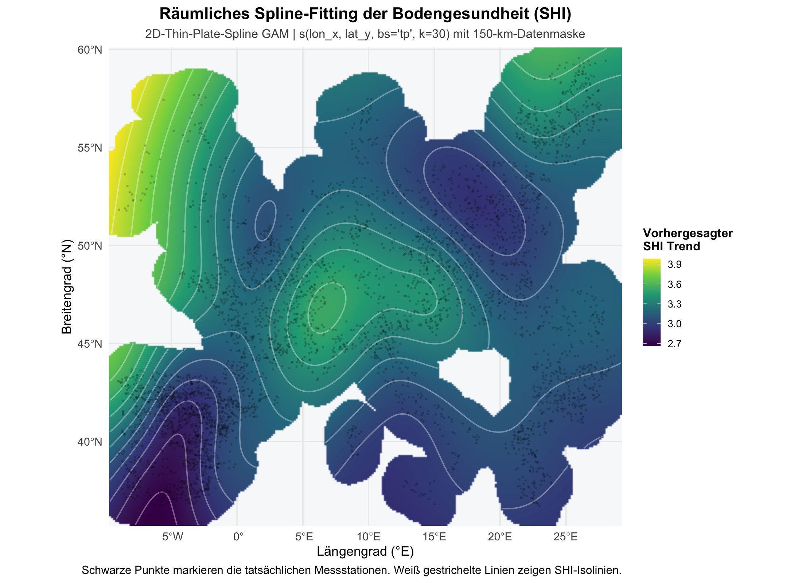
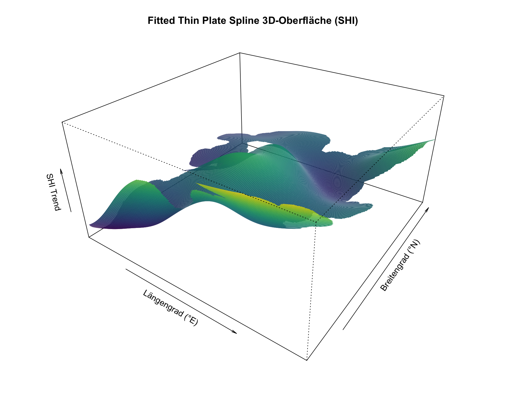

# Walkthrough: Thin Plate Spline (TPS) Fitting & Visualisierung

Die Implementierung der Thin-Plate-Spline-Anpassung (TPS) für den Bodengesundheitsindex (Soil Health Index, SHI) über Europa wurde erfolgreich durchgeführt. Alle Ausgaben befinden sich in diesem Ordner.

## Generierte Dateien in diesem Ordner

1. **[tps_spline_2d.png](tps_spline_2d.png)**:
   - Eine geglättete 2D-Rasterdarstellung des SHI-Trends über Europa mit weißen Isolinien (Konturen) und einer dezenten Einblendung der originalen Messpunkte im Hintergrund.
2. **[tps_spline_3d_static.png](tps_spline_3d_static.png)**:
   - Eine statische 3D-Perspektivenfläche der interpolierten Bodengesundheit (unter Verwendung einer Viridis-Palette).
3. **[tps_spline_3d.html](tps_spline_3d.html)**:
   - Eine interaktive 3D-Oberfläche (erstellt mit `plotly`), die im Webbrowser frei gedreht und gezoomt werden kann.
   - Die zugehörigen JavaScript-Ressourcen liegen direkt daneben im Ordner `tps_spline_3d_files/`.

---

## Visualisierungen

### 1. 2D-Raster- und Kontur-Plot

### 2. Statischer 3D-Oberflächen-Plot

