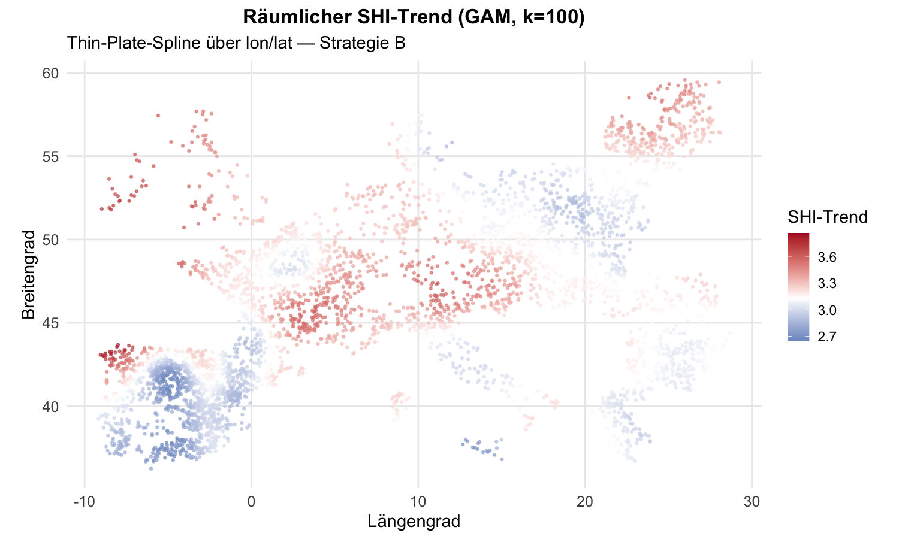
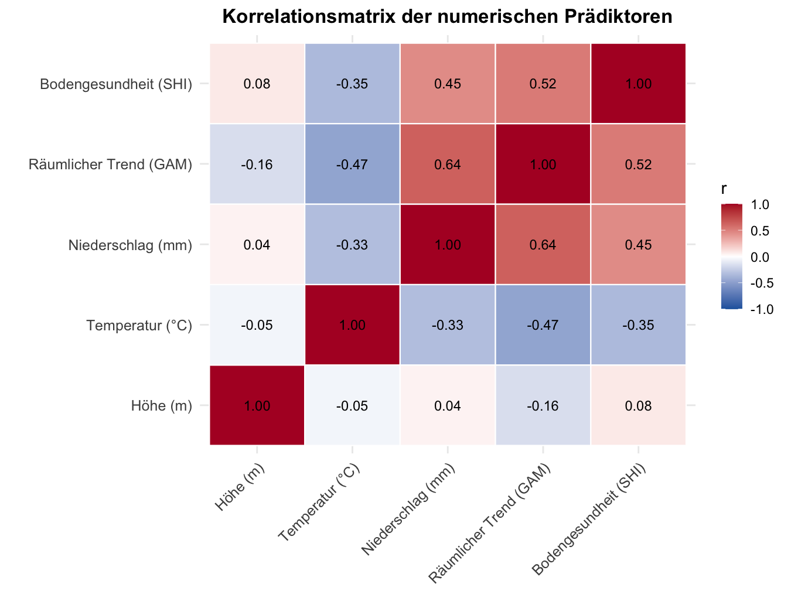
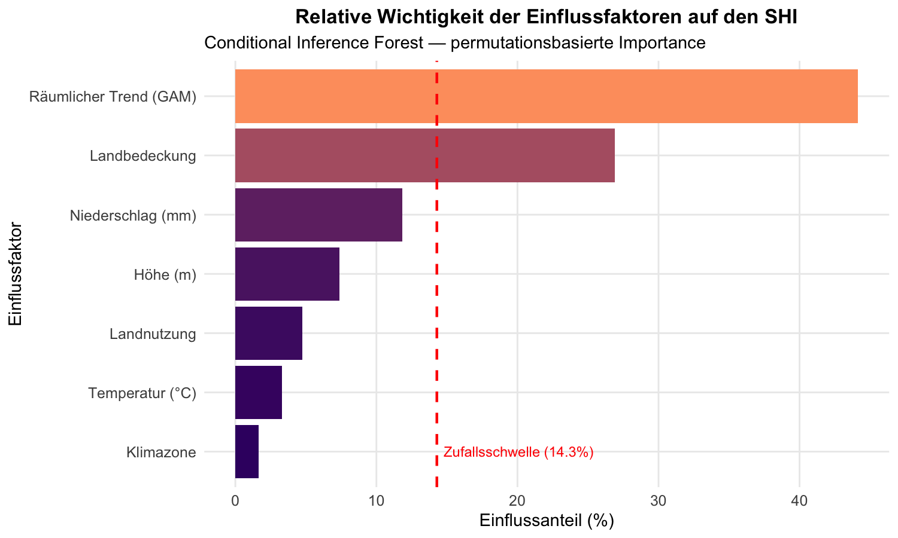
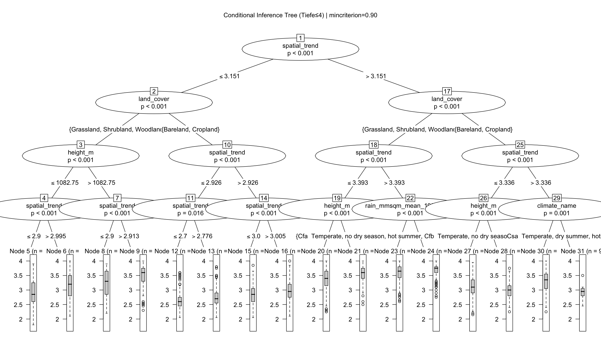
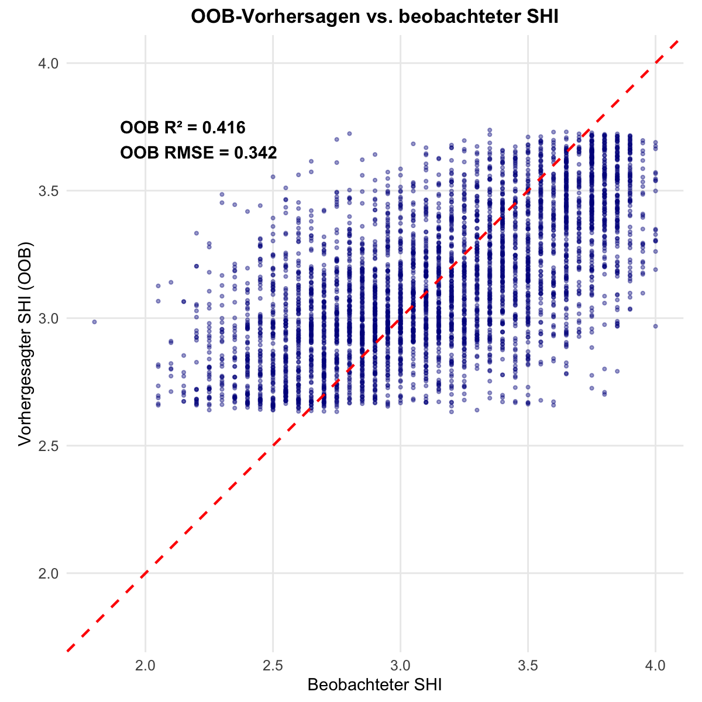
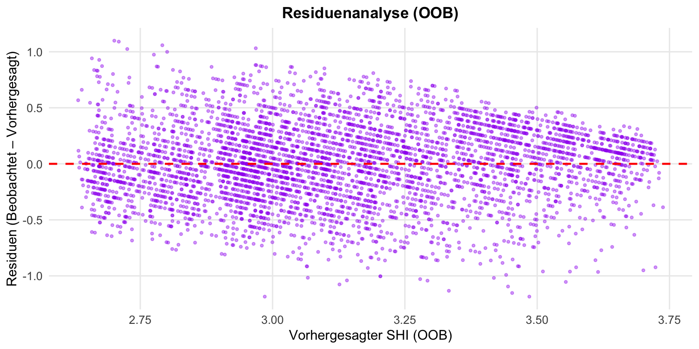

# Interpretation der Modell-Grafiken

In diesem Dokument werden alle vom Random-Forest-Skript erzeugten Diagramme (aus dem Ordner `output_lat-long/Grafiken_png/`) fachlich interpretiert.

## 1. Räumlicher Hintergrundtrend (GAM)

**Was zeigt die Karte?**
Jeder untersuchte Punkt in Europa ist nach seinem isolierten "räumlichen Trend" eingefärbt, der durch das Generalisierte Additive Modell (GAM) aus den Koordinaten berechnet wurde.
**Beobachtung & Interpretation:**
- Diese Karte zeigt den rein räumlichen Basis-SHI, unabhängig von Klima oder lokaler Landnutzung.
- Regionen in wärmeren Farben (Gelb/Rot) markieren geografisch günstigere Makrolagen für die Bodengesundheit, oft bedingt durch Ozeanität oder latente großräumige Einflüsse.
- Diese ermittelten Werte fließen als numerisches Feature `spatial_trend` direkt in den Random Forest ein, um die räumliche Autokorrelation "herauszurechnen" und als Wissen nutzbar zu machen.

## 2. Korrelationsmatrix

**Was zeigt sie?**
Die paarweisen linearen Zusammenhänge zwischen allen numerischen Features (inklusive `spatial_trend`) und der Zielvariable (`SHI`).
**Beobachtung & Interpretation:**
- **Keine starke Multikollinearität:** Alle Einflussvariablen haben untereinander Korrelationen von $|r| < 0.7$, was bedeutet, dass sie sich gegenseitig nicht redundant überlagern. 
- `spatial_trend` zeigt erwartungsgemäß Zusammenhänge mit Temperatur und Niederschlag, liefert aber für das Modell immer noch so viel unabhängigen Informationsmehrwert, dass es als eigenständiges Feature Sinn ergibt.

## 3. SHI nach Landnutzung und Landbedeckung

**Was zeigt die Grafik?**
Boxplots der SHI-Verteilung gruppiert nach `land_use` (links) und `land_cover` (rechts).
**Beobachtung & Interpretation:**
- Wälder (`Forestry` / `Woodland`) und naturnahe Flächen zeigen signifikant höhere und stabilere Median-Werte in der Bodengesundheit.
- Intensiv genutzte Flächen (`Agriculture`, `Cropland`) sowie kahle Böden (`Bareland`) weisen im Median deutlich niedrigere SHI-Werte und stärkere Schwankungen auf.

## 4. Feature Importance (Variablenwichtigkeit)

**Was zeigt sie?**
Den prozentualen Erklärungsbeitrag jeder Variablen für die Gesamtgenauigkeit des Random Forests.
**Beobachtung & Interpretation:**
- Variablen wie **Landbedeckung**, **Niederschlag** und der neu eingeführte **Räumliche Trend (`spatial_trend`)** besitzen die größten Balken. Sie sind die absoluten Haupttreiber des Modells.
- Da der Balken von `spatial_trend` weit rechts der gestrichelten roten Zufallsschwelle liegt, ist mathematisch bewiesen, dass die geografische Lage signifikant zur Erklärung des SHI beiträgt.

## 5. Entscheidungsbaum (Decision Tree)

**Was zeigt der Baum?**
Einen exemplarisch abgeleiteten `ctree` (Conditional Inference Tree), der die iterativen Split-Regeln des Random Forests visuell greifbar macht.
**Beobachtung & Interpretation:**
- Der oberste Split (Root-Node) ist die allerwichtigste Trennregel für den gesamten Datensatz (oft Landbedeckung oder der räumliche Trend).
- Die Endknoten (die Boxplots ganz unten) zeigen, wie hoch der erwartete SHI ist, wenn alle logischen Bedingungen des jeweiligen Pfades durchlaufen wurden. Hier erkennt man Interaktionen (z.B. "Wenn viel Regen UND Wald, dann SHI extrem hoch").

## 6. Modellvorhersage vs. Beobachtung

**Was zeigt die Grafik?**
Auf der X-Achse die tatsächlich gemessenen SHI-Werte (aus dem Datensatz), auf der Y-Achse die Vorhersage (Out-of-Bag) des Modells.
**Beobachtung & Interpretation:**
- Die Punkte gruppieren sich als Punktwolke um die gestrichelte rote 1:1-Ideallinie.
- Dies illustriert visuell das $R^2$ des Modells (~40 %). Lägen alle Vorhersagen perfekt, wären alle Punkte exakt auf der roten Linie. Für ökologische Daten ist diese moderate Streuung vollkommen normal.

## 7. Residuenverteilung

**Was zeigt sie?**
Den Vorhersagefehler (Modellvorhersage minus echter Wert) gegenüber der Vorhersage.
**Beobachtung & Interpretation:**
- Die Punkte streuen relativ symmetrisch um die Null-Linie (blaue Linie). Das bedeutet, das Modell weist keinen starken systematischen Über- oder Unterschätzungsfehler auf. Das Rauschen ist zufällig.
