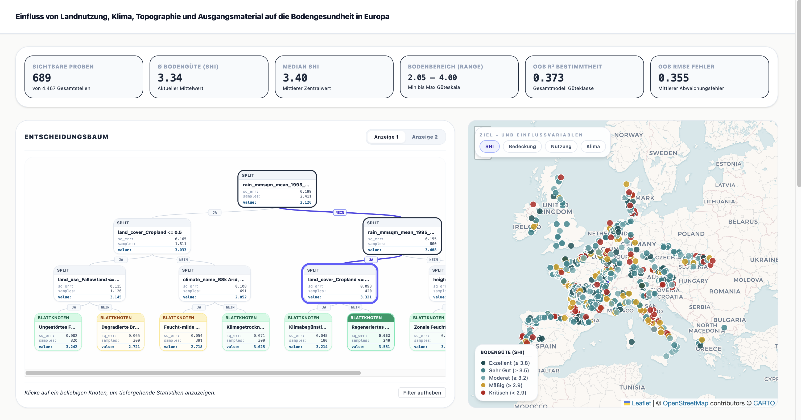
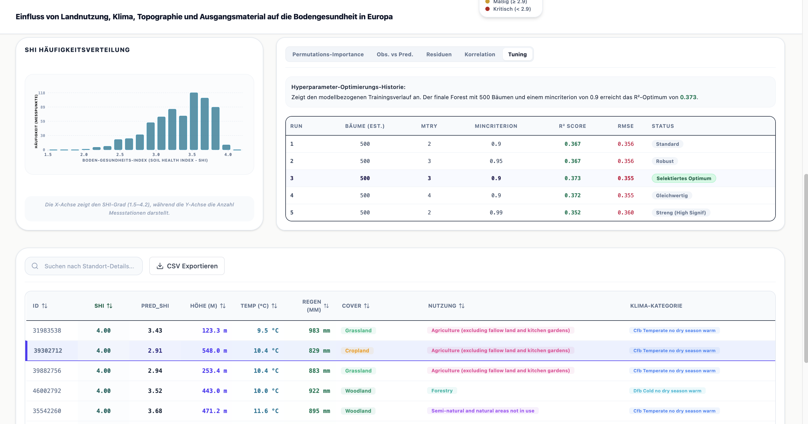

# Bodengesundheit-Explorer (Soil Health Index Analysis)

Diese Webanwendung dient der interaktiven Analyse und Visualisierung von Bodengesundheitsdaten (SHI) in Europa. Sie ermöglicht es, den Einfluss von Landnutzung, Klima, Topographie und Ausgangsmaterial auf die Bodengesundheit mithilfe von Entscheidungsbäumen und geografischen Karten zu explorieren.

<p>
  
  
</p>

## Schnellstart-Anleitung

Folge diesen Schritten, um die Anwendung lokal auf deinem Computer auszuführen. 

### 1. Voraussetzungen
Stelle sicher, dass du **Node.js** (Version 18 oder höher empfohlen) auf deinem Rechner installiert hast. Du kannst dies prüfen, indem du `node -v` in dein Terminal eingibst.

### 2. Installation
Öffne dein Terminal im Projektverzeichnis und installiere alle benötigten Pakete:

```bash
npm install
```

1. Install dependencies:
   `npm install`
2. Run the app:
   `npm run dev`
### 3. Anwendung starten
Starte den lokalen Entwicklungsserver:

```bash
npm run dev
```

### 4. Im Browser ansehen
Nach dem Start erscheint im Terminal eine Meldung wie:
`➜  Local:   http://localhost:5173/`

Halte die **Strg-Taste** (oder Cmd auf Mac) gedrückt und klicke auf den Link, oder kopiere die Adresse manuell in deinen Browser (z. B. Firefox, Chrome oder Safari).


## Funktionen der Anwendung

- **Interaktiver Entscheidungsbaum:** Filtere die Daten live durch Auswahl von Knoten im Modell.
- **Geografische Karte:** Visualisierung der Probenpunkte in Europa mit verschiedenen Farbmodi (SHI, Landnutzung, Klima).
- **Wissenschaftliche Validierung:** Einblick in Modellgüte (R², RMSE), Feature Importance und Residuenanalysen.
- **Datentabelle:** Durchsuche die Rohdaten und exportiere gefilterte Ansichten als CSV.

## Technologien

- **Frontend:** React, TypeScript, Tailwind CSS
- **Karten:** Leaflet.js
- **Icons:** Lucide React
- **Build-Tool:** Vite