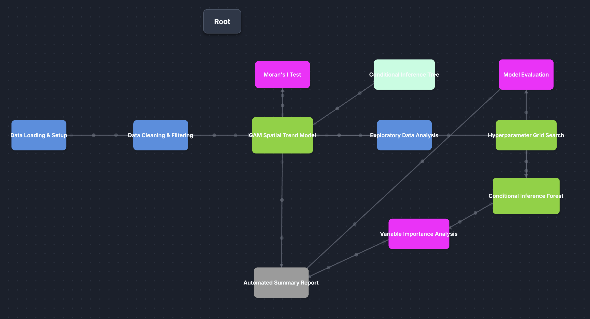
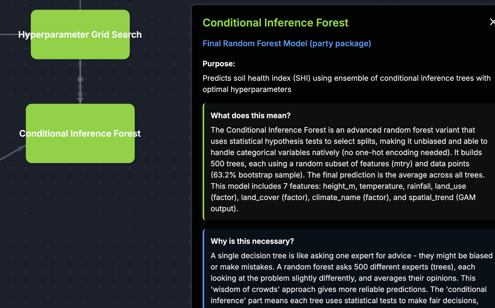
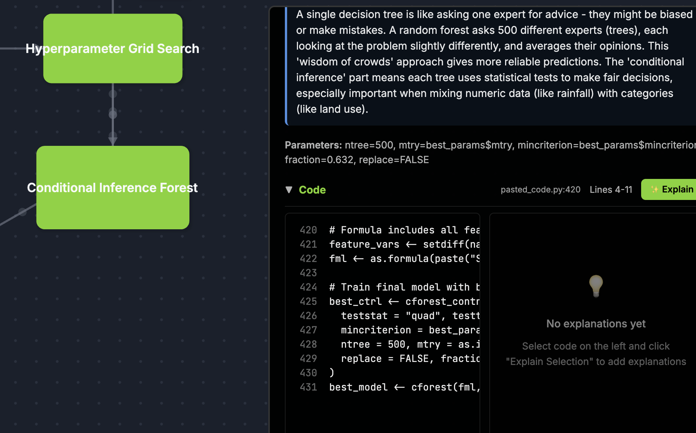

# Random Forest zur Bewertung der Bodengesundheit (SHI)

Analyse des Soil Health Index (SHI) in Europa mithilfe eines Conditional Inference Forest (R‑Paket `party`). Das Modell untersucht den Einfluss von Klima, Topografie, Landnutzung und Landbedeckung auf die Bodengesundheit. Zusätzlich wird in einer erweiterten Variante der räumliche Hintergrundtrend per GAM‑Spline einbezogen.

---

## 1. Setup

### 1.1 Repository klonen

```bash
git clone https://github.com/Gianni-BIM/Geo-Projektarbeit.git
cd Geo-Projektarbeit
git checkout ML-rf-Ioannis
cd RandomForest_R
```

### 1.2. R installieren

- [R herunterladen](https://cran.r-project.org/) (Version ≥ 4.2)
- Optional: [RStudio](https://posit.co/downloads/) als IDE

### 1.3. R‑Pakete installieren

```bash
Rscript install_packages.R
```

Oder manuell in R:
```R
install.packages(c("party", "mgcv", "ggplot2", "reshape2",
                   "gridExtra", "GGally", "spdep", "partykit"))
```

### 1.4. Skripte ausführen

```bash
# Basismodell (ohne räumlichen Trend)
Rscript random_forest_shi.R

# Erweitertes Modell (mit GAM lat/lon → spatial_trend)
Rscript random_forest_shi_lat-long.R
```

---

## 2. Gegeben

Räumliche Stichproben (Punkte in Europa) mit folgenden Umweltparametern:

| Variable | Bezeichnung | Typ |
|----------|-------------|-----|
| `height_m` | Topografische Höhe (m) | numerisch |
| `temp_c_mean_1995_2024` | Mittlere Temperatur (°C) | numerisch |
| `rain_mmsqm_mean_1995_2024` | Mittlerer Niederschlag (mm) | numerisch |
| `land_use` | Landnutzung | kategorial |
| `land_cover` | Landbedeckung | kategorial |
| `climate_name` | Köppen‑Geiger‑Klimazone | kategorial |

Im erweiterten Skript (`lat-long`) kommt zusätzlich `spatial_trend` hinzu — ein per GAM erzeugtes Feature, das den räumlichen Hintergrundtrend codiert.

## 3. Gesucht

- **Vorhersage** des Soil Health Index (SHI)
- **Einflussfaktoren** — welche Umweltparameter bestimmen die Bodengesundheit am stärksten?
- **Interaktionen** — wie wirken Klima, Landnutzung und Geografie zusammen?

---

## 4. Methodik

1. **Datenaufbereitung** — Entfernen von IDs/Koordinaten, Hobley‑Filterung (Kategorien < 30 Beobachtungen), Faktorisierung.
2. **Feature Engineering** (nur lat‑long) — GAM‑Thin‑Plate‑Spline über Koordinaten → `spatial_trend`.
3. **Hyperparameter‑Optimierung** — Grid Search über `mtry` und `mincriterion` mit OOB‑R² als Metrik.
4. **Modelltraining** — Conditional Inference Forest (`party::cforest`, 500 Bäume).
5. **Evaluation** — Out‑of‑Bag‑Validierung (R², RMSE), Residualanalyse.
6. **Interpretation** — Permutationsbasierte Variable Importance, Entscheidungsbaum‑Visualisierung.

---

## 5. Ergebnisse

### Vergleich: Basismodell vs. erweitertes Modell (lat‑long)

| Metrik | Basismodell | Lat‑Long (+ GAM) |
|--------|------------|-------------------|
| **OOB R²** | ~0.37 (37 %) | ~0.40 (40 %) |
| **OOB RMSE** | ~0.355 | ~0.347 |
| **Prädiktoren** | 6 | 7 (+ spatial_trend) |

### Wichtigste Einflussfaktoren (Variable Importance)

**Basismodell:**
1. Niederschlag (~34 %)
2. Landbedeckung (~31 %)
3. Temperatur (~13 %)

**Erweitertes Modell (lat‑long):**
1. Landbedeckung (~32 %)
2. Räumlicher Trend / spatial_trend (~27 %)
3. Niederschlag (~18 %)

> Der räumliche Trend (GAM) verbessert das Modell um ca. 3 Prozentpunkte R² und zeigt, dass geografische Lage (z. B. atlantisch vs. kontinental) einen eigenständigen Einfluss auf die Bodengesundheit hat.

### Kernaussagen

- **Feuchte, gemäßigte Klimazonen** (Cfb) zeigen die höchsten SHI‑Werte.
- **Waldbedeckung und naturnahe Flächen** fördern die Bodengesundheit.
- **Intensive Landwirtschaft** senkt den SHI messbar.
- Der **räumliche Trend** codiert großräumige West‑Ost‑ und Nord‑Süd‑Gradienten, die über reine Klima‑ und Landnutzungsdaten hinausgehen.

---
## 6. Visuelle Erklärung des Skriptes `random_forest_shi_lat-long.R`

https://codesplain.ai/share/3e44c29bb29f99337efd5cdf1465804d






## 7. Projektstruktur

```
RandomForest_R

├── random_forest_shi.R                  # Basismodell
├── random_forest_shi_lat-long.R         # Erweitertes Modell mit Lat/Long
├── random_forest_shi_lat-long.Rmd       # Interaktiver Report (RMarkdown)
├── tps_fitting_plot.R                   # Thin-Plate-Spline-Fitting (GAM) & 2D/3D-Visualisierung
├── install_packages.R                   # Paketinstallation
│
├── input/
│   └── Daten/
│       ├── points.csv                   # Eingabedaten
│       └── legend.txt                   # Köppen-Geiger-Legende
│
├── output/                              # Ergebnisse Basismodell
│   ├── Grafiken_png/
│   └── Modell_Zusammenfassung/
│
├── output_lat-long/                     # Ergebnisse erweitertes Modell
│   ├── Grafiken_png/
│   ├── Modell_Zusammenfassung/
│   └── tps_fitting_plot-Modell/         # Ergebnisse des Thin-Plate-Spline Fitts (2D/3D-Plots & Walkthrough)
│
├── Dokumentation/
│   ├── DATEN_DOKUMENTATION.md
│   └── DATEN_DOKUMENTATION_LAT-LONG.md
│
└── .gitignore
```
