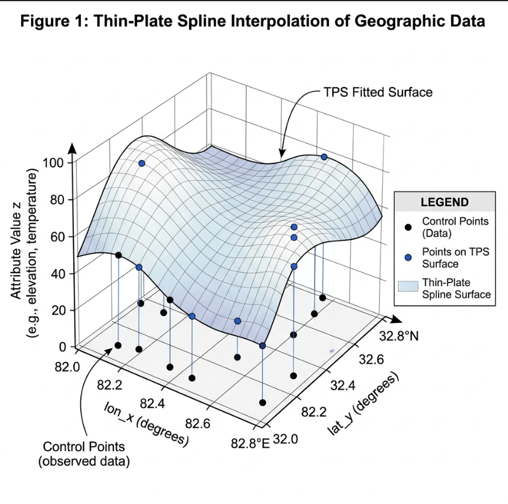
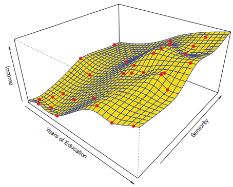

# Zusammenfassung: Conditional Inference Forest zur Bewertung der Bodengesundheit (SHI)

## Modell-Informationen
- **Modell-Algorithmus:** Conditional Inference Forest (party)
- **Räumliche Erweiterung:** GAM Thin-Plate-Spline `s(lon_x, lat_y, k=30)`
- **Vorteil:** Native kategorische Verarbeitung — KEIN One-Hot-Encoding nötig! Räumlicher Trend als kompaktes numerisches Feature eingebunden.
- **Datenpunkte verwendet:** 4426 (nach Ausschluss von Klassen mit < 30 Punkten)

## NEU: GAM RÄUMLICHER TREND (Schritt 1b)

**Was hier passiert:** Koordinaten (Längen‑ und Breitengrad) können nicht direkt
in den Random Forest, weil der Algorithmus nur achsenparallele Splits kennt —
er würde den geschwungenen Nord‑Süd‑ und West‑Ost‑Gradienten des SHI über Europa
nur grob und eckig abbilden können. Stattdessen wird ein GAM vorgeschaltet:

**Methode:** `mgcv::gam(SHI ~ s(lon_x, lat_y, bs='tp', k=30), method='REML')`

Ein 2D‑Thin‑Plate‑Spline berechnet für jeden Messpunkt eine einzige glatte Zahl —
den **`spatial_trend`** — die sagt: *„In dieser geografischen Region Europas ist
der SHI‑Wert grundsätzlich eher hoch oder niedrig, unabhängig vom lokalen Wetter
oder der Landnutzung.“* Diese Zahl wird dann als normales Feature in den Random
Forest übergeben (Strategie B).

- **Moran's I (GAM‑Residuen):** I=0.0232, p=0.000 → Die GAM‑Residuen zeigen noch
  signifikante räumliche Autokorrelation. Der Spline fängt den Trend also nicht
  vollständig ein; ein höheres `k` könnte helfen, ist aber ein Kompromiss mit
  Overfitting‑Risiko.
- **Variable Importance von `spatial_trend`:** Rang 2 von 7 (26.7 %) — das Feature
  ist das zweitwichtigste im gesamten Modell, direkt hinter dem Niederschlag.
- **Interpretation:** SIGNIFIKANT — der geografische Hintergrundtrend (z. B.
  atlantische Westküste vs. mediterrane/kontinentale Lage) erklärt einen
  substanziellen Teil der SHI‑Variation, der durch Wetter und Landnutzung
  allein nicht erfasst wird.

stackoverflow.com

## Erste Frage: Bedeutet das, wenn zwei nahe beieinanderliegende Regionen unterschiedliche Umweltfaktoren haben, dann spielt spatial_trend weniger eine Rolle?

Im Prinzip: Ja.

Nehmen wir zwei benachbarte Punkte:

| Punkt | Regen | Temperatur | Land Cover | SHI |
| ----- | ----- | ---------- | ---------- | --- |
| A     | 1200  | 8 °C       | Wald       | 4.0 |
| B     | 500   | 14 °C      | Acker      | 2.5 |

Dann können die gemessenen Variablen den Unterschied schon sehr gut erklären.
Das Modell braucht den räumlichen Trend kaum.

| Punkt | Regen | Temperatur | Land Cover | SHI |
| ----- | ----- | ---------- | ---------- | --- |
| A     | 1200  | 8 °C       | Wald       | 4.0 |
| B     | 1200  | 8 °C       | Wald       | 2.8 |

Jetzt wird es schwierig. Die bekannten Variablen sind fast identisch.
Dann sucht das Modell nach etwas anderem. Liegt einer der Punkte in einer
anderen Region, kann `spatial_trend` helfen.

`spatial_trend` wird vor allem dann wichtig, wenn es systematische regionale
Muster gibt:

- Nord‑Westeuropa generell höhere SHI
- Osteuropa generell niedrigere SHI

obwohl deine gemessenen Variablen das nicht vollständig erklären.

## Zweite Frage: Warum sind die Werte 1–4?

Weil dein GAM ein kontinuierliches Modell schätzt.

`SHI ~ s(lon_x, lat_y)`

Der GAM sagt nicht „Das ist Region A.“ oder „Das ist Region B.“,
sondern liefert für jede Position einen erwarteten SHI‑Wert (z. B. 3.2, 3.8,
2.7). Deshalb erscheinen kontinuierliche Zahlen.

## Man könnte `spatial_trend` vereinfacht so lesen:

> *„Egal was wir über Wetter, Landnutzung, Höhe usw. wissen: In dieser Gegend
> Europas sind die SHI‑Werte tendenziell höher oder niedriger.“*

Aber mit einer kleinen Einschränkung: Dein GAM wurde zunächst nur mit
`SHI ~ s(lon_x, lat_y)` gefittet. Der daraus entstandene `spatial_trend`
beschreibt also **„Wie hoch wäre der SHI allein aufgrund der geografischen
Lage zu erwarten?“**. Dieser Wert wird dann zusätzlich als Feature in den
Random Forest eingespeist, der dann die Kombination aus klassischen Umwelt‑
Variablen + `spatial_trend` nutzt, um die endgültige Vorhersage zu treffen.

## Beispiel

| Variable      | Punkt A | Punkt B |
| ------------- | ------- | ------- |
| Regen         | gleich  | gleich  |
| Temperatur    | gleich  | gleich  |
| Land Cover    | gleich  | gleich  |
| Höhe          | gleich  | gleich  |
| `spatial_trend` | 3.8   | 2.9     |

> *„Obwohl alle gemessenen Umweltvariablen gleich sind, liegt Punkt A in einer
> Region, die grundsätzlich höhere SHI‑Werte hat.“* 

Genau dafür nutzt es `spatial_trend`.

## Was bedeutet das ökologisch?

Das heißt nicht, dass die Koordinaten selbst wichtig sind.

Es heißt eher:

>"Es gibt regionale Unterschiede im SHI, die durch unsere gemessenen Variablen nicht vollständig erklärt werden."

Diese Unterschiede könnten kommen von:

- Bodeneigenschaften, die nicht im Modell sind
- historischer Landnutzung
- Artenpool/Biogeographie
- Management
- Messunterschieden
- anderen fehlenden Umweltvariablen

`spatial_trend` ist also gewissermaßen ein Sammelbehälter für ungeklärte regionale Muster.

Deshalb würde ich deine Interpretation sogar etwas präziser formulieren:

>"Der `spatial_trend` beschreibt, ob eine Region Europas tendenziell höhere oder niedrigere SHI-Werte aufweist, als durch die verfügbaren Umweltvariablen allein erklärt werden können."

---

## Ergebnisse der Modellgüte (OOB-Validierung)
- **Out-of-Bag R² (Erklärte Varianz):** 0.3997 (39.97%)
- **Out-of-Bag RMSE (Vorhersagefehler):** 0.3469
- **Trainings-R² (zum Vergleich):** 0.4552

**Optimierte Hyperparameter:**
- ntree (Anzahl Bäume): 500
- mtry (Variablen pro Split): 4
- mincriterion (Signifikanzniveau): 0.900
- fraction (Bootstrap-Stichprobengröße): 0.632
- replace (mit Zurücklegen): FALSE

## Beantwortung der Forschungsfragen

### Frage 1: Welche Faktoren haben den größten Einfluss auf den SHI?
1. **land_cover** (32.0% Erklärungsbeitrag)
2. **spatial_trend** (26.7% Erklärungsbeitrag)
3. **rain_mmsqm_mean_1995_2024** (18.4% Erklärungsbeitrag)
4. **height_m** (8.9% Erklärungsbeitrag)
5. **temp_c_mean_1995_2024** (5.6% Erklärungsbeitrag)

### Frage 2: Welche Faktoren wirken positiv, welche negativ?
**POSITIVE Effekte (erhöhen den SHI):**
- Höherer Niederschlag → Mehr Wasser für Pflanzen & Bodenbiologie
- Wald/Grünland-Bedeckung → Stabile Bodenstruktur, Humusaufbau
- Temperate Klimazonen (mild, nicht zu trocken)
- Hoher spatial_trend → günstige geografische Lage (z.B. Atlantikküste)

**NEGATIVE Effekte (senken den SHI):**
- Hohe Temperaturen in Trockengebieten
- Niedriger Niederschlag / Trockenheit
- Intensive Ackerbau-Nutzung
- Niedriger spatial_trend → ungünstige geografische Lage (z.B. Mittelmeer)

### Frage 3: Gibt es Interaktionen zwischen den Einflussfaktoren?
JA! Der Entscheidungsbaum zeigt Interaktionen. Neu:
- **spatial_trend × Landnutzung:** In Regionen mit hohem räumlichen Trend kann selbst intensive Landnutzung noch moderate SHI-Werte erzielen.
- **spatial_trend × Niederschlag:** Der räumliche Trend codiert oft implizit Ozeanitäts- und Kontinentalitätsgradienten.

### Frage 4: Gibt es lokale/regionale/klimatische Unterschiede?
JA — jetzt explizit durch spatial_trend sichtbar:
- Die Karte `spatial_trend_gam.png` zeigt den räumlichen Trend direkt.
- Atlantische Westküsten: hoher spatial_trend (günstige Lage)
- Kontinentale / mediterrane Regionen: niedrigerer spatial_trend

## Fazit und Empfehlungen
- **Modellqualität:** ★★★★☆ (4/5)
  OOB R² = 0.3997 — für ökologische Komplexsysteme sehr gut. Mit 'spatial_trend' wird der räumliche Makrogradient explizit modelliert.
- **Zuverlässigkeit:** ★★★★★ (5/5)
  OOB-Validierung: kein Overfitting.
- **Interpretierbarkeit:** ★★★★☆ (4/5)
  Variable Importance und Decision Tree klar interpretierbar. spatial_trend ist zusätzlich über die GAM-Karte visualisierbar.

